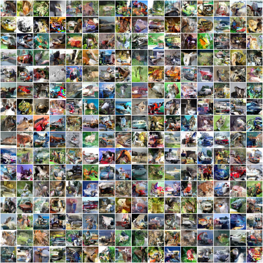

# Discretized Logistic Mixtures on Semantically Dissimilar and Proximal Values

This repository contains my experimentation on whether discretized logistic
mixtures can be applied to parameterised distributions over discrete values
where discrete values that are close to one another may have entirely different
semantics.

For example, on image data we know that discrete value 128 is similar to 127 and
129, and so are likely to have similar probabilities. The smoothness of the
distribution is illustrated in Figure 1 of [PixelCNN++](https://arxiv.org/abs/1701.05517) 
which means the model can simply predict the mixture of distributions, rather
than an explicit N-way softmax. This leads to massive computational savings and
faster convergence due to denser gradients.

However, can this method be applied data where close values have entirely
different semantics? For example, in an NLP task token 1234 and token 1235 may
refer to `cat` and `热茶` respectively. Discrete latents 0 and 1 in a VQ-VAE
codebook may map to vectors that are far away in the continuous latent space.

My intuition says no, however I am unable to find much discussion of this
elsewhere. If it were possible, it could massively reduce the dimensionality of
the output, leading to a similar improvements in computational efficiency and
convergence speed.

So to confirm my suspicions, I propose a simple experiment:
- Construct an injective mapping from pixel intensities to a random discrete
  value in the same domain.
- Take some image dataset, say CIFAR-10 or MNIST-style, and augment all
  intensities using this random mapping. 
- Proceed as in PixelCNN++ using this augmented dataset, except discarding
  probability mass that falls outside the valid range of values as we no longer
  should bias towards the extremities of the distribution.

To speed things up, I've copied a flax implementation of PixelCNN++ as provided
in the examples [here](https://github.com/google/flax/tree/master/examples/pixelcnn). 

The rest of this README is precisely the contents of their original README.

---

## PixelCNN++ image modelling
Trains a PixelCNN++ model [(Salimans et al.,
2017)](https://arxiv.org/abs/1701.05517) for image generation on the CIFAR-10 dataset.
Only unconditional image generation is implemented, trained using ADAM
on the negative log-likelihood. As in the original [OpenAI implementation](https://github.com/openai/pixel-cnn)
we use weightnorm parameterization with data-dependent initialization.

Code for sampling is also provided. The following image, containing 256 samples, was generated in 4m 24s
on an 8 x Nvidia V100 machine.


### Requirements (Training)
* [TF datasets](https://www.tensorflow.org/datasets), which will download and cache the CIFAR-10 dataset the first time you
  run `train.py`.

### Requirements (Sampling)
* [Pillow](https://pillow.readthedocs.io/en/stable/) for saving samples as PNG files.

### Supported setups
The model should run with other configurations and hardware, but was tested on the following.

| Hardware | Batch size | Training time | Log-likelihood (bits/dimension) | TensorBoard.dev |
| --- | --- | --- | --- | --- |
| 8 x Nvidia V100 (16GB)  | 320  |  1d 14h | 2.923 | [2020-04-23](https://tensorboard.dev/experiment/t8fM3u2zSJG7tAx6YbXHkQ/) |
| 8 x TPUv3 (16GB)  | 320  |  4d4h | 2.927 | [2020-08-15](https://tensorboard.dev/experiment/6rTypNzlSN2o7pfNWJOjMw/) |

### How to run
#### 8 x Nvidia V100 (16GB), 8 x TPUv3 (16GB)

To run training:

```
python main.py --workdir=/tmp/pixelcnn --config=configs/default.py \
               --config.batch_size=320
```

To run sampling (this will automatically load model parameters from the most
recent trained checkpoint):

```
python main.py --workdir=/tmp/pixelcnn --sample --config=configs/default.py \
               --config.sample_batch_size=256
```
